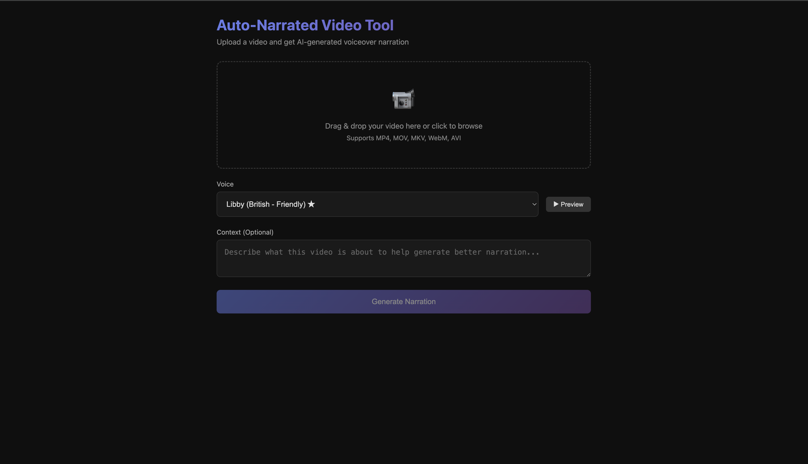
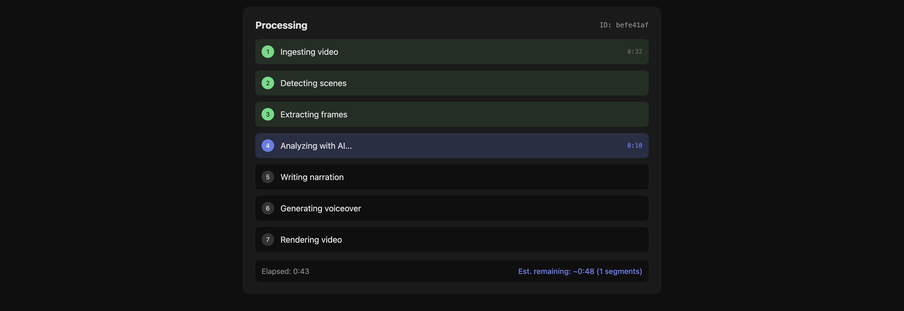
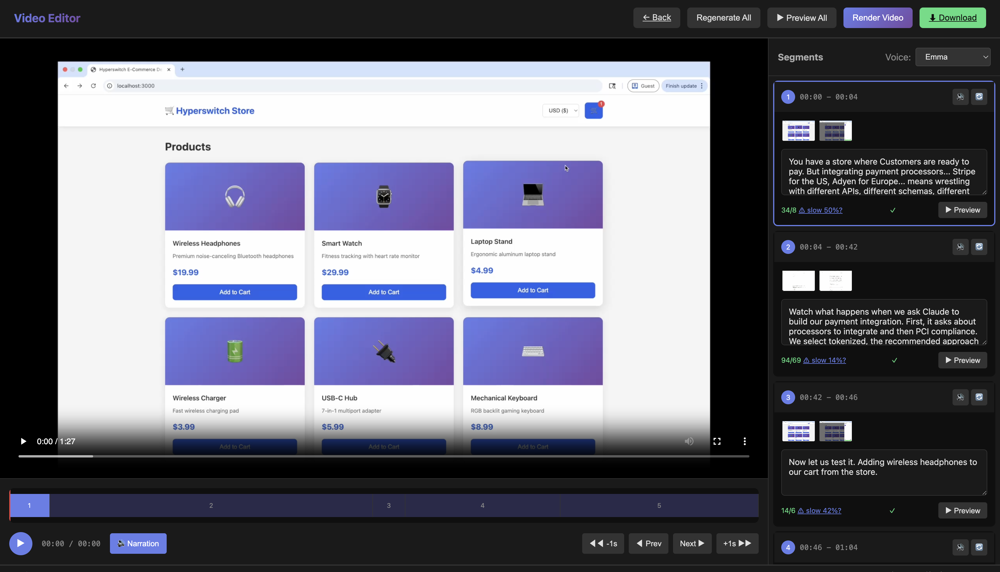

# AutoNarrate

Transform any screen recording or product demo into an engaging, professionally narrated video - automatically.

## What It Does

1. **Upload a video** - Any screen recording, product demo, or tutorial
2. **AI analyzes each scene** - Detects scene changes, reads on-screen text (OCR), understands what's happening
3. **Generates narration** - Creates natural, flowing voiceover script
4. **Synthesizes speech** - Converts script to high-quality voice using Edge TTS
5. **Renders final video** - Combines everything with smart freeze-frames when narration is longer than the video segment

## Features

- **🤖 Claude Code Integration** - Uses your local Claude CLI for vision analysis (no API keys needed!)
- **OpenCode Support** - Works with OpenCode CLI and any LLM provider it supports
- **Direct API Support** - Use OpenAI (GPT-4o) or Anthropic (Claude) APIs directly
- **Ollama Support** - Or use Ollama for fully local, free processing
- **Smart Scene Detection** - Automatically segments video based on visual changes
- **Multiple Voice Options** - Choose from various natural-sounding voices
- **Freeze Frame Support** - Video pauses on last frame when narration extends beyond segment
- **Live Preview** - Preview narration with video before rendering
- **Edit & Customize** - Modify narration text, regenerate specific segments
- **No Audio Cutoff** - Narration always plays completely, video adapts

## Screenshots

<p align="center">
  
  <br><em>Upload your video and select a voice</em>
</p>

<p align="center">
  
  <br><em>AI analyzes your video and generates narration</em>
</p>

<p align="center">
  
  <br><em>Edit narration, preview with video, and render</em>
</p>

## Quick Start

### Option 1: Setup with Claude Code (Easiest)

Paste this prompt into Claude Code:

```
Clone https://github.com/apoorvdixit88/autonarrate and set it up:
1. Clone the repo
2. Create a Python virtual environment
3. Install dependencies from requirements.txt
4. Copy .env.example to .env
5. Check if ffmpeg is installed, if not tell me how to install it
6. Start the server with python run.py
```

### Option 2: Automated Setup

```bash
# Clone the repository
git clone https://github.com/apoorvdixit88/autonarrate.git
cd autonarrate

# Run setup script
chmod +x setup.sh
./setup.sh
```

### Option 3: Manual Setup

#### Prerequisites

1. **Python 3.10+**
   ```bash
   python3 --version  # Should be 3.10 or higher
   ```

2. **FFmpeg** (required for video processing)
   ```bash
   # macOS
   brew install ffmpeg

   # Ubuntu/Debian
   sudo apt update && sudo apt install ffmpeg

   # Windows (using chocolatey)
   choco install ffmpeg
   ```

3. **AI Backend** (for video analysis) - Choose one:

   **Option A: Claude Code (Recommended)**
   ```bash
   # Install Claude Code CLI
   npm install -g @anthropic-ai/claude-code

   # Verify installation
   claude --version
   ```

   **Option B: OpenCode (Multi-provider)**
   ```bash
   # Install OpenCode
   curl -fsSL https://opencode.ai/install | bash
   # or: brew install anomalyco/tap/opencode

   # Connect to your preferred LLM provider
   opencode
   # Press /connect and choose: OpenAI, Anthropic, Gemini, Ollama, etc.
   ```

   **Option C: OpenAI API**
   ```bash
   # Just add your API key to .env
   VISION_BACKEND=openai
   OPENAI_API_KEY=sk-...
   OPENAI_MODEL=gpt-4o  # or gpt-4-turbo, gpt-4o-mini
   ```

   **Option D: Anthropic API**
   ```bash
   # Just add your API key to .env
   VISION_BACKEND=anthropic
   ANTHROPIC_API_KEY=sk-ant-...
   ANTHROPIC_MODEL=claude-sonnet-4-20250514
   ```

   **Option E: Ollama (Free, Local)**
   ```bash
   # Install Ollama
   curl -fsSL https://ollama.com/install.sh | sh

   # Pull a vision model
   ollama pull llama3.2-vision
   ```

#### Installation

```bash
# Create virtual environment
python3 -m venv venv
source venv/bin/activate  # On Windows: venv\Scripts\activate

# Install dependencies
pip install -r requirements.txt

# Copy environment config
cp .env.example .env

# Edit .env if needed (optional)
nano .env
```

#### Run the Server

```bash
# Activate virtual environment (if not already)
source venv/bin/activate

# Start the server
python run.py
```

Open http://localhost:3005 in your browser.

## Configuration

Edit `.env` to customize:

```env
# Server settings
HOST=0.0.0.0
PORT=3005
DEBUG=true

# Vision backend: "claude_code", "opencode", "ollama", "openai", or "anthropic"
VISION_BACKEND=claude_code

# OpenAI settings (if using openai backend)
OPENAI_API_KEY=sk-...
OPENAI_MODEL=gpt-4o

# Anthropic settings (if using anthropic backend)
ANTHROPIC_API_KEY=sk-ant-...
ANTHROPIC_MODEL=claude-sonnet-4-20250514

# Ollama settings (if using ollama backend)
OLLAMA_MODEL=llama3.2-vision
OLLAMA_HOST=http://localhost:11434

# Default TTS voice
TTS_VOICE=en-US-EmmaNeural

# Paths
PROJECTS_DIR=./projects
CLAUDE_CODE_PATH=claude
OPENCODE_PATH=opencode
```

## Usage

### 1. Upload Video

- Go to http://localhost:3005
- Upload your video (MP4, MOV, MKV, WebM, AVI supported)
- Optionally add context about your product/video

### 2. Wait for Processing

The pipeline will:
- Detect scenes and segment the video
- Extract key frames from each segment
- Analyze frames with AI (OCR + visual understanding)
- Generate narration script
- Synthesize voiceover audio

### 3. Edit & Preview

- Click on a segment to edit narration
- Use "Preview" to hear individual segments
- Use "Preview All" to watch full video with narration
- Adjust voice from the dropdown

### 4. Render & Download

- Click "Render Video" to create final output
- Download your narrated video

## Available Voices

| Voice | Accent | Style |
|-------|--------|-------|
| Emma | US | Friendly, conversational |
| Libby | UK | Professional, clear |
| Jenny | US | Warm, engaging |
| Guy | US | Authoritative, calm |
| Ryan | UK | Professional, neutral |
| Christopher | US | Clear, instructional |

## How Freeze Frames Work

When narration is longer than a video segment:

1. Video plays normally until segment end
2. **Video freezes** on the last frame
3. Narration continues playing
4. When narration finishes, video resumes
5. Next segment begins

This ensures narration is never cut off mid-sentence.

## Project Structure

```
autonarrate/
├── app/
│   ├── main.py              # FastAPI application
│   ├── config.py            # Configuration settings
│   ├── models.py            # Data models
│   ├── pipeline.py          # Processing pipeline
│   ├── services/
│   │   ├── video_service.py     # Video ingestion
│   │   ├── vision_service.py    # AI frame analysis
│   │   ├── narration_service.py # Script generation
│   │   ├── tts_service.py       # Text-to-speech
│   │   └── audio_service.py     # Audio processing
│   └── utils/
│       ├── ffmpeg.py        # FFmpeg operations
│       └── logger.py        # Logging
├── static/
│   ├── index.html           # Upload page
│   └── editor.html          # Video editor
├── projects/                # Generated project files
├── requirements.txt
├── setup.sh                 # Automated setup script
├── run.py                   # Server entry point
└── .env.example
```

## Troubleshooting

### FFmpeg not found
```bash
# Verify FFmpeg is installed
ffmpeg -version

# If not found, install it (see Prerequisites)
```

### Claude Code not working
```bash
# Check if Claude Code is installed
claude --version

# If using Ollama instead, update .env:
VISION_BACKEND=ollama
```

### Port already in use
```bash
# Change port in .env
PORT=3006
```

### Video processing fails
- Ensure video is a supported format (MP4 recommended)
- Check FFmpeg is properly installed
- Look at terminal logs for specific errors

## Contributing

Contributions welcome! Please:
1. Fork the repository
2. Create a feature branch
3. Make your changes
4. Submit a pull request

## License

MIT License - feel free to use for personal or commercial projects.

---

Built with Claude Code
